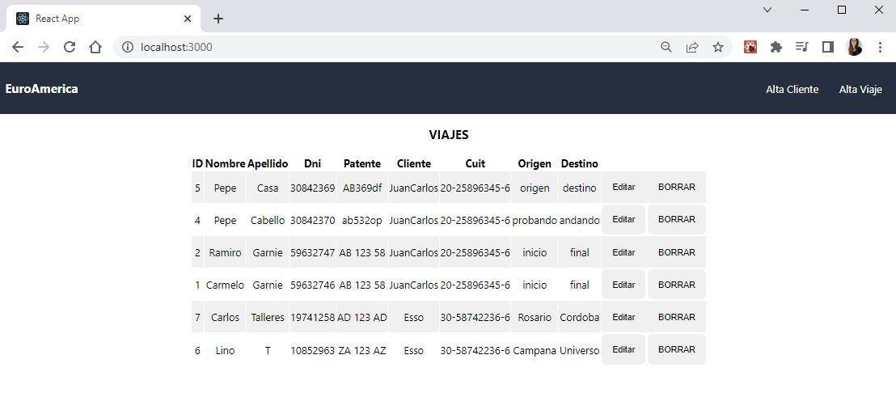
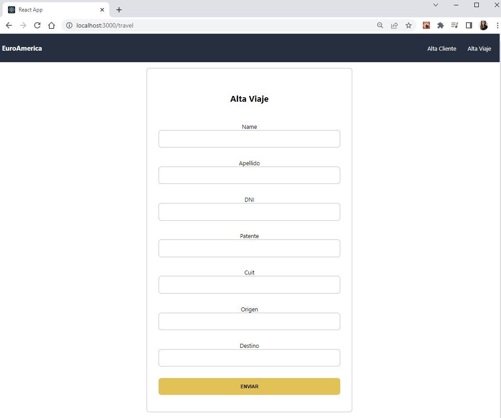
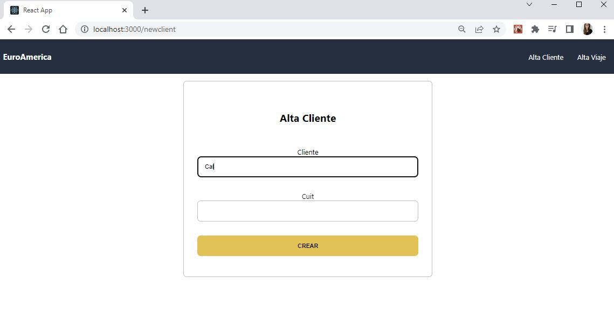
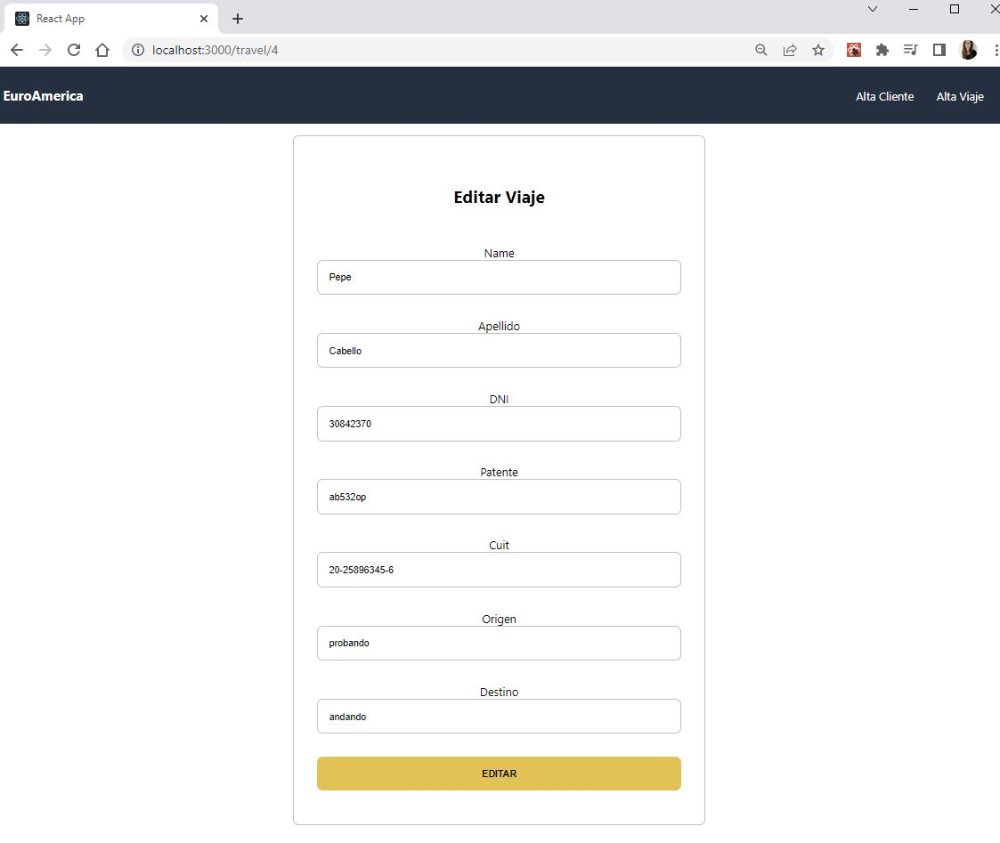

#### Tecnologías utilizadas:

- [ ] React
- [ ] Redux
- [ ] Express
- [ ] Sequelize - Postgres

  
   
  
   
 
  

Ejercicio entrevista técnica
Departamento: Sistemas
Puesto: Desarrollador

Se requiere crear un sistema de gestión de viajes de choferes con las siguientes pautas.

1. Un formulario para el Alta de un cliente con los siguientes datos
   id
   Cliente o Nombre
   CUIT
2. Un formulario para la Alta/baja/modificación de un viaje con los siguientes datos:
   id
   Nombre chofer
   Apellido chofer
   DNI chofer
   Patente
   CUIT CLIENTE
   Origen
   Destino
3. Mostrar los viajes en una lista o tabla con una consulta SQL
